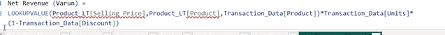

# DATA VIZUALIZATION

- graphical representation of information and data

- Tools for Data Vitualization available
1. power BI
2. IBM Cognos anlytics'
3. Tableau
4. Qlik Sense

# POWER BI (Power Business Intelligence)
- picks up data from different sources , cleans and combines the data , then convert the data into vizualization and then generate repoerts.

- Power BI Desktop is used to create reports and to share these reports we use PowerBI Service .

- power bi is microsoft product

- reports can be exported to excel

- creates a highly compressed dataset that loads data into memory(RAM) for fast repsonse

- high quality vizualises are used

- we can also use custom visuals 

- Q&A Natural language query can be used to easily build visuals

- automatically generates insights for data (generates the understanding of the data)

### VERSIONS OF POWERBI

1. Power BI Desktop(limit to analyze is 1GB)
2. Power BI Pro(more space,more access to software)
3. Power BI Premium (more storage spcae)
4. Power BI Mobile
5. Power BI Embedded (integration of power BI with other softwares)
6. Power BI Report Server (to publish our reports in our own server for security)

## Types of Views in PowerBI

1. Report View
2. Table View
3. Model View (to combine data, creating relationship between tables)

## STEPS IN POWER BI

- power query is a ETL tool (extract transformation Load)
- power query is the backend to tranform the data using M-language
- power query uses M-Language(Mashup Langauge)
- in power query , the steps are recoreded in applied steps
- the source contains the source of all tables(queries)
- the data is read and automatically  changes the data type of all columns  
- to change the data to uppercase, lowercase etc right click on column -> transform -> uppercase

- to add the tranformations to new column , we can perform in Add Column tab (for text text column , for numbers number column)

## Transaction vs Lookup tables
##### Lookup 
- Lookup are small in size
- lookup have columns with unique values called as PRIMARY KEY
- No duplicates
- usually meant for description of data
- usually for analysis 
##### Transaction
- big in size
- duplicates are present 
- usually meant for calculations 
- is referred to lookup table using foreign key

- converting wide table to long table is called unpivoting(right click on column name and select unpivot other columns to make other columns as data)

- we can use if and to avoid mistakes in if else , can be done in custom column

# DATA MODELLING

- extract the data from multiple tables and connect these tables together and creating a relationship between the tables 

- creating relationship between tables and develop the power bi reports using different fields from multiple data tables from multiple sources

## NORMALIZATION

- process of organizing the tables and columns in a relational database to reduce redundancy and preserve data integrity.

- minimizes errors 

- lookup and fact table

## SCHEMAS

- lookup tables are inturn associated wiht other lookup tables

- Relationships

## DATA ANALYTICS EXPRESSIONS

- formula language (everything is predefined) that created calculated columns, calculated measures and calculated tables in Power BI front-end
### CALCUALTED COLUMNS

- Calculated columns understand row-context (it maps the columns, suppose we can map that this particular region must have a particular manager)

- collection of functions,operators and cosntants that can be used  in a formula, or expression to calculate and return one or more values

- calulated columns are shown as rows and columns and slices (visuals) , calculated measures are shown as values

### CALCULATED MEASURES

- Calculated Measure -> numerical summaried calue and stored in field list with measure header , we cannot see the numerical value directly in data model

- not visible in tables , can only see in visualization 

- wont increase file size

- mostly uses DAX functions

- evaluated based on filter context (filter visuals)

1.  Related - To get columns from other table, using related we create a separate column
~~~m
Net Revenue = RELATED(Product_LT[Selling Price])*Transaction_Data[Units]*(1-Trasaction_Data[Discount])
~~~

2. LookValue

3. SUMX - using sumx we create a new measure , new column is not created

4. Calender
         1. for Year -> YEAR(DateTable[Date])
         2. for quarter -> QUARTER(DateTable[Date])
         ~~~m
         Quarter Name = "Qtr "&DateTable[Quarter]
         ~~~
         3. Month ->
         ~~~m
         Month No = MONTH(DateTable[Date])
         ~~~
         4. Month Name ->
         ~~~m
         Month Name = FORMAT(DateTable[Date],"MMMM")
         ~~~
         5. Day ->
         ~~~m
         Day = DAY(DateTable[Date])
         ~~~
         6. Day Name -> day of the week
         ~~~m
         Day Name = FORMAT(DateTable[Date],"DDDD")
         ~~~
         7. WeekDay -> 1 means the week starts with sunday
         ~~~m
         WeekDAy No = WEEKDAY(DateTable[Date],1) 
         ~~~
         8. Week number
         ~~~m
         WeekNum = WEEKNUM(DateTable[Date],1)
         ~~~
         9. WeekDay or WeekENd
         ~~~m
         WeekDay/End = 
        IF(
        OR(DateTable[WeekDAy No]=1,DateTable[WeekDAy No]=7),
        "WeekEnd",
        "WeekDay"
         )
        ~~~

# FUNCTIONS

- find is case sensitive , Search is not case sensitive

- iterator functions do not create another column 

- to replace values at certain range of position
~~~m
Replace = REPLACE(Orders[Product ID],5,2,"IN")
~~~

- CALCULATE - we can use our own filters -> useful for comparisions

- using all we get the total sales

~~~m
AllSales = CALCULATE([Total Sales],ALL(Orders))
~~~

# CHARTS

- bar and column are used for comparision 
1. Stacked column chart -> Legends are used to do categorization individually

- the information that is shown in the box are called tool tips.
- Small multiples -> to divide into further segments 

2. Line charts - used when we have date elements

4. Waterfall charts - for financial purpose

5. Funnel charts - to see changes level wise (suppose at what level many people are eliminated from a hiring process). Showly progressively smaller changes in a process

6. Scatter chart - when we have numerical values on both x and y axis

7. Pie Charts - for proportions

8. Tree map - when we hierarchical data to show

### CHART ELEMENTS

1. chart area - all elements of a chart
2. plot area - has bars or lines or .....
3. gridlines - represents values of y axis
4. Data labels - values on top of bars (represents the value of y axis but on top of bars)
5. legend - to compare more than one category
6. data series 

### BEST PRACTISES TO INCREASE PERFORMANCE 

- KPI visuals always considers,last quater,last month and last day as achievement.
- KPI visuals works with time intelligence functions
- if we take year on trend axis, the kpi will show the total sales for year 2023 as achievement
- if we take last quarter, it shows the sum of last quarters of all years.

## SQL CONNECTION
- can be connected in two ways
1. import mode : the data is downloaded into the system ram , faster retrieval of data

2. DirectQuery mode : data is not imported to powerBI , connection is established to the server and queries are used to import data.

3. LIve conenction 

## ROW LEVEL SECURITY 

- to control acess to data at the individual row level 
- can be created using manage roles in modelling
- using view roles we can switch between roles

